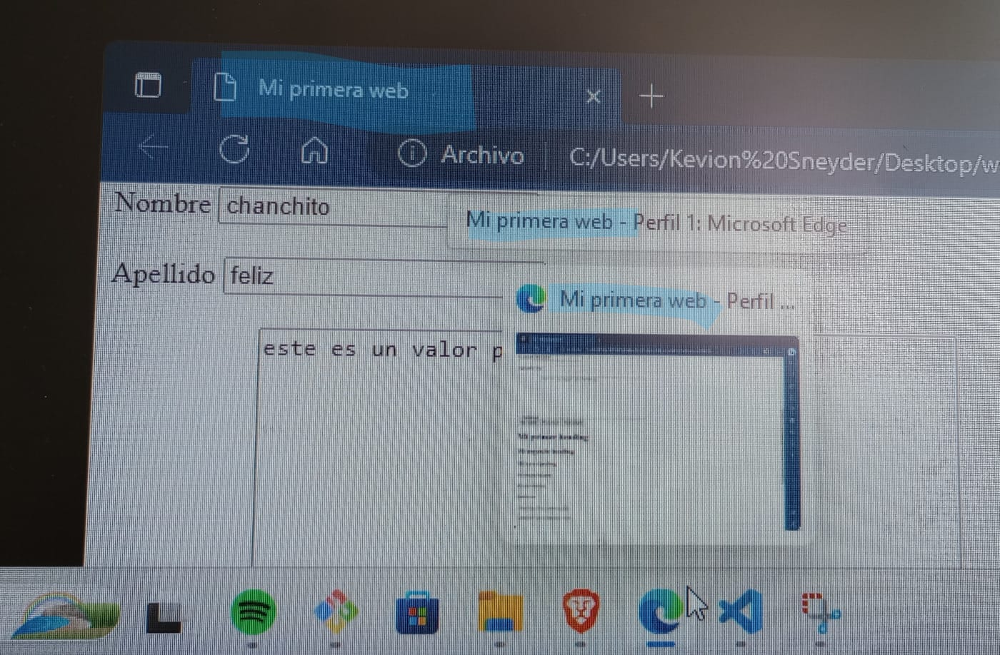
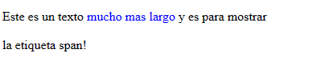
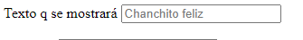
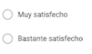
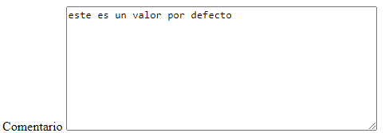
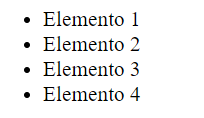
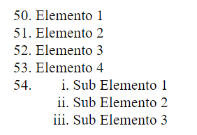
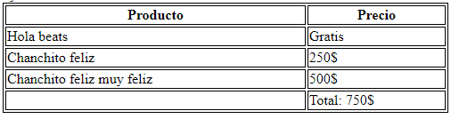

# HTML (Hipertext Markup Language)Extención:   .html
Lenguaje estandar para crear paginas web hoy en día, describiendo su estructura o como sera el orden de la pagina, esto mediante etiquetas y ordenando estas a su vez mediante el identado(separación respecto a las etiqueta anterior de un *tab* o *"cuatro espacios"*)

    html>estructura
    css>diseño
    js>interactividad

## Context root:
(Raiz del proyexto web) una buena practica es meter todos nuestros archivos en diferentes carpertas, todos los q sean una subpagina de lo q será nuestro sitio se recomienda guardarlo en una subcarpeta llamada *web*; y asi con todos de manera q el unico archivo q no este contenido sea el principal el *index*

## Etiquetas:

Las etiquetas *vacias* son aquellas q no tienen contenido visible, por lo q no será necesario abrir y cerrrar, sino q dentro de si misma se cerrara "/"
`!`

Genera una structura por defecto de html; al princio aparecera lo siguiente indicando que será interpretado en formato *html 5*
```html
<!Doctype html>
```
---

`<lorem>`

Crea un texto por defecto para realizar las pruebas correspondientes a como se vería en nuestra web

---

`&`

Para poner carácteres q no tengá mi teclado; o q se suelen usar en etiquetas por lo q para no generar inconsistencias se debe poner: &codigoDelCarácter

```html
<p>&excl; simbolo exclamación</p>
```
* `&nbsp;`

Para poner mas *espacios* o *tabs* de los q permite el editor de código

---
*Control+espacio*

Sirve para ver las diferentes opciones q hay dentro de cada etiqueta

---
`<hr>`

Horizontal rule> Crea una linea horizontal para dividir o crear secciones visuales 

---
`../` 

Esto quiere decir q vamos a subir(salir-devolvernos) en nuestra ubicación una carpeta o nivel

---
`<!---->`

Para crear notas o comentarios que no veran los usuarios
```html
<!--el comentario-->
```

---
---
---
## index.html

Indica q esa pagina será la principal o la pagina de entrada en nuestro web
### HEAD `<head></head>`

Será en donde indicaremos las caracteristicas que tendra la pagina web, las cuales no necesariamente seran visibles al usuario

`<title></title>`

Sera el nombre que aparecera en la pestaña de nuestra pagina, esta también sera relevante para mostrar la pagina al usar el buscador web

```html
<title>mi primera web</title>
```


`<style> </style>`
```html
<style>
        table, th, td {
            border: 1px solid black;
        }
</style>
```
Al hacer estas etiqueteas en head se pude especificar el style especifico para los tipos de comandos q queremos q sea aplicado; asi no se tendra q estar repitiendo el codig. Este style sera especificado entre las { } y antes de esta iran las etiquetas a las q queremos q la modificación sea aplicada.

`<link/>`

Para señalar q cargaremos las carácteristicas o atributos desde otro archivo (El cual será un css)
```html
    <link rel="stylesheet" href="CSS/estilos.css"/> 
```
`rel=` señalará el tipo de atributos q dará ese `css`

`href=` señalará la ubicación del archivo `css` desde donde traeremos los atributos

---
---
### BODY `<body></body>`

Sera la sección en la que se pondrá todo el contenido de nuestra pagina web, la cual si sera visible al usuario


`<h1></h1>`

Para poner hasta 6 clases de titulos, eligiendo entre ellos escribiendo el numero del 1-6 a su derecha
```html
<h1>Titulo 1</h1>
<h2>Titulo 2</h2>
<h3>Titulo 3</h3>
<h4>Titulo 4</h4>
<h5>Titulo 5</h5>
<h6>Titulo 6</h6>
```
---
`<p></p>`

Para crear parrafos 
```html
<p>Este será un parrafo</p>
```
Para darle negrita al párrafo
```html
<p><b>Mi primer página HTML</b></p>
```
Para señalar algún párrafo importante(Este tipi también se mostrará en negrita)
```html
<p><strong>Segundo párrafo</strong></p>
```
Para poner en italica el párrafo(cursiva)
```html
<p><i>tercer párrafo</i></p>
```
Para enfatizar algun texto(Este tendrá la misma respuesta visual q `<i>` aunque tiene un proposito diferente)
```html
<p><em>cuarto párrafo</em></p>
```
Párrafo pequeño
```html
<p><small>quinta parrafo</small></p>
```
Para resaltar el párrafo
```html
<p><mark>sexto párrafo</mark></p>
```
Para tachar nuestro párrafo
```html
<p><del>séptimo párrafo</del></p>
```
Para subrayar el párrafo(pero su significado es q el texto fue insertado)
```html
<p><ins>octavo párrafo</ins></p>
```
Para especificar subindice
```html
<p>noveno <sub>p</sub> párrafo</p>
```
Para especificar superindice
```html
<p>décimo <sup>p</sup>árrafo</p>
```
Para mostrár código desde la pagina html
```html
<p><code>Este es mi código</code></p>
```
---
`<pre></pre>`

Preformated> Crea párrafos al igual q con <p> pero la diferencia es q estos se mostraran tal cual en la web como se muestran en el codigo, incluso respetando simplemente los *tabs* sin necesidad del `<br/>`.

---
`<span></span>`

Para identificar, o referenciar texto dentro de otras etiquetas. Para hacerlo visible se puede usar una subetiqueta: style
```html
Este texto es <span style="color:blue">mucho mas largo</span> y es para mostrar la etiqueta span!
```


---
`<br/>`

Genera un salto de linea
```html
<br>
```
---
`<a></a>`

ancord o hipervinculo; de estos hay dos tipos generales:

* Rutas Relativas: Solo necesita el nombre del archivo y su extención, ya q esta dirrección y en la q estamos escribiendo deben  compartir carpeta (ejm:/contenido.html)(Al poner el "/" al principio indicamos q será una *ruta relativa* pero a toda nuestra página web; es decir, q el simbolo hará buscar la subcarpeta desde el inicio o la parte externa de nuestro proyecto)
* Rutas Absolutas: Especifica la Ip/puerto/nombreDelArchivo (ejm:http://localhost:5500/contenido.html) 

Las *Rutas Absolutas* no se recomiendan si la página pertence a la misma aplicación ya q estas dirreciones pueden cambiar durante la realización del proyecto, y se dañaria el link por lo q en este caso se recomienda usar las *rutas relativas*; Pero si la pagina esta en otro sitio web es mejor usar las *rutas absolutas*.

1. Cargará el link dentro de la misma pestaña en q estemos
```html
<a href="https://www.linkcualquiera.com">texto q direccionara al link</a>
```
2. Redirrecionará la pagina del link a una nueva pestaña

```html
<a target="blank" href="https://www.linkcualquiera.com">texto q direccionara al link</a>
```

3. Para q el usuario con el link salte de un lugar a otro dentro de la misma pagina utilizando los Marcadores o Bookmarks(esto se hace indicando un id especifico, y luego usando ese id en el codigo para llegar allí)(se usa generalmente en el *footer*)
```html
<a href="#nombre del id al q queremos llegar">descripción q verá el usuario para saber a donde sera dirigido este texto contendra el link</a>
```

4. Para abrir mi aplicación de correos, y enviar un mensaje a la dirreción de correo indicada

```html
<a href="mailto:CualquierCorreo@gmail.com">texto para enviar mensaje al correo indicado</a>
```
   * Para enviar no solo tener la dirrección de correo listo, sino todo un e-mail predefinido
```html
<a href="mailto:informes@globalmentoring.com.mx?subjet=contacto&body=Quiero información">Enviar email</a>
```

5. Para movernos dentro de las diferentes paginas de nuestra carpeta de la web
```html
<a href="nombredelapaginaparamovernosennuestraweb.html">Ir a página1</a>
```
---
``

Para insertar imagenes a nuestra pagina, usando src (ource): 
1. Subir una imagen desde la web usando el link de esta:
```html

```
2. Subir una imagen desde el almacenamiento interno de nuestra pc, recomendable poner estas imagenes dentro de una sección para ellas en la carpeta de archivos de la pagina:
```html

```
* Para darle alguna medida en especifico a las imagenes en cualquiera de las dos opciones (si solo se da una de las dos medias la imagen se escalara a los pixeles especificados en esta):
```html

```
* Para q un link `</a>` no tenga letras sino una imagen como enlace
se sube la imagen en la parte donde se suele poner el texto a mostrar, en el centro:
```html
<a href="http://globalmentoring.com.mx" target="_blank">
        
    </a>
````
* El atributo texto alternativo o *alt=""* para q la imagen tenga contenida dentro de si algun texto como descripción; la diferencia de *title* es q el *alt* solo se mostrará si la imagen no carga.(Estos dos atributos sirven tanto para imagenes como para párrafos)

---
`<iframe> </iframe>`

Es un marco ajustable con css en el q podremos agragar información html, por lo q podremos cargar otras paginas html, otros sitios web directamente en el html, videos, imagenes, documentos, etc...

1. Para mostrar una pagina html, q se encuentra dentro de la misma carpeta en la q estemos trabajando
```html
<iframe src="texto.html"></iframe>
```
2. Para mostrar una pagina q se encuentra en otro sitio web
```html
<iframe src="http://globalmentoring.com.mx"></iframe>
```
3. Para mostrar por defecto una página, pero con un boton para cambiar la dirrección de le q se muestra en el iframe
```html
<iframe src="texto.html" name="marco1"></iframe>
    <a href="http://globalmentoring.com.mx" target="marco1">Cargar sitio</a>
```

---
`<form> </form>`(Sección dentro de body)

Es la sección dedicada a los formularios, donde el usuario pondra la información requerida

`<form action="/formulario" method="post">` 

action= para indicar el servidor al q se enviara la información requerida

method= para indicar el metodo con el q se enviara la informacion; estos pueden ser `Get` (recomendado) o `post`.
```html
 <form action="/formulario" method="post">
        <label for="Nombre">Texto q se mostrará</label>
        <input value="chanchito" type="text" id="Nombre" name="Nombre" placeholder="Chanchito feliz" required="true"/>
```
novalidate=Si se agrega esta palabra al lado del form `<form novalidate>` hará q ese formulario sea enviado sin validar su contenido

* `<label for="Nombre">Texto q se mostrará</label>` Label es q le muestra al usuario q información se le esta pidiendo en el input

    for= Le dará al label una acción; esta etiqueta funciona junto con `id`, siendo `for` la enviará el "click" al `id`

* `<input value="chanchito" type="text" id="Nombre" name="Nombre" placeholder="Chanchito feliz required="true""/>` Input es la casilla q será el campo en el q el usuario podrá escribir la información a la q se le hace referencia desde el label (Permite capturar información del usuario)

    
    
    value=Agrega en el input un texto por defecto, esto es usado para mostrarle al usuario un ejemplo de lo se espera q ponga allí; sin embargo, el usuario podrá enviar este texto en su formulario y el servidor lo tomará como un dato normal y no uno por defecto

    type=El input tiene mas de un "modo" por lo q type servira para elegir esto

    1. text: para escribir texto normal(sino se especifica el type, esta es la opcion q trae el input por defecto)
    2. email:input dedicado a escribir dirreciones de correo
    3. password: input dedicado a escribir contraseñas(con este se ocultará lo q el usuario ponga en el input)
    4. radio: 

        
    5. checkbox: lo mismo q radio pero con forma cuadrada (son casillas para q el usuario realice una selección)
    6. file: Convierte al input en un espacio para q el usuario suba archivos a la pagina
    7. submit: Un tipo de boton par enviar los datos del formulario

    id= Es un atrivuto de identificación por lo q el mismo `id` no se debe repetir, cada `id` sera usado para una sola etiqueta (los atributos nos permiten interactuar con los elementos, pero por si solo no cumple sus caracteristicas completas) En sus funciones esta la opcion crear hipervinculos dentro de la misma pagina con `<a>`, tambíen se usa con **java** para dar style u otras funciones; pero también tiene la función de ser el q recibirá la acción del for en el label; esta etiqueta funciona junto con `for`, siendo `id` la q recibirá el "click" del `for`
    
    name=Es para q el servidor sepa cual es la información recibida en cada input ya q el id no cumplira esta función, sin embargo es recomendable q ambos tengan el mismo nombre (esto no será visible para el usuario)

    placeholder=Agrega en el input una "marca de agua", esto es usado para mostrarle al usuario lo se espera q ponga allí.

    required=Este atributo al poner "true" impedirá q el formulario sea enviado si ese input no esta rellenado, pero si este es "false" o si simplemente se omite el formulario se enviará asi esos inputs esten vacios

```html
<label for="Comentario">Comentario</label> 
        <textarea cols="50" rows="10" id="Comentario" name="Comentario" placeholder="ingrese comentario" >este es un valor por defecto</textarea>
```
* `<textarea cols="50" rows="10" id="Comentario" name="Comentario" placeholder="ingrese comentario" >este es un valor por defecto</textarea>` testarea agrega una casilla parecida al input, type text con la diferencia de q esta se usa para textos mas largos ya q sus dimensiones son modificables
    

    Cols=Columnas / Rows=Files : Estas etiquetas son para modificar las dimensiones del texarea con pixeles como medida(Si solo se usa una de las dos medidas el texarea la tomara como medida para escalarar)
* `Button`
```html
<button type="button">Tipo boton</button>
<button type="reset">Tipo reset</button>
<button type="submit">Tipo submit</button>
```
type= es para darle al button su función (si este nose especifica el q tendrá por defecto sera "submit")

1. button=Se debe especificar el comportamiento q se quiere de este (esto se hace con java) 
2. reset=Volvera a dejar el formulario con los valores q tenia por defecto
3. submit=Enviara el formulario al servidor con el metodo q se especifico en el inicio de form> method 

`formnovalidate="formnovalidate"` Al agregarle este atributo al submit, la información podrá ser enviada sin validarse por medio de este

`<button type="button" img src=Link o ubicación imagen>Tipo boton</button>`

img=al agragar esto, el boton no tendra letras sino imagenes.

---
`<ul>`(Sección dentro de body para listas)`<ol>`

* `<ul> </ul>`

Unordered list; cada q agregemos un nuevo elemento a esta lista estos tendran un "punto" como guión 
```html
 <ul>
     <li>Elemento 1 </li>
     <li>Elemento 2 </li>
     <li>Elemento 3 </li>
     <li>Elemento 4 </li>
 </ul>
```

   
* `<ol> </ol>`

Ordered list; con este metodo para crear listas, cada elemento se enumerará automaticamente en lugar de tender "puntos". Al poner en un `<li>` un `<ol>` y dentro de este un `<li>` se creara una sublista (si a esta no se le especifica el style la numeración por defecto serán numeros normales)
```html
<ol>
     <li value="50">Elemento 1 </li>
     <li>Elemento 2 </li>
     <li>Elemento 3 </li>
     <li>Elemento 4 </li>
     <li>
        <ol>
            <li style="list-style-type:lower-roman ;">Sub Elemento 1</li>
            <li style="list-style-type:lower-roman ;">Sub Elemento 2</li>
            <li style="list-style-type:lower-roman ;">Sub Elemento 3</li>
        </ol>
    </li>
</ol>
```


* `<dl></dl>`

Description list; primero irá el termino, y luego su descripción (Es como un diccionario)

1. `dt` description term; Este será el termino

2. `dd` description data; Esta será la descripción del `dt`

* `<li> </li>` List item
Es para poner los elementos q conforman la lista
    
    value= 	Indica el valor inicial que tendrá ese campo de datos; apartir del numero indicado allí 
    
    style= Este atributo nos permite modificar visualmente en elmentos HTML el color, la fuente, entre otros.Aquí es usado para cambiar el estilo de letras, numeración 

    `style="list-style-type:lower-roman` Cambiará el icono o guión del `<li>`, esto desde el tipo de lista al q pertenezcan los `<li>` a afectar `ol/ul`; también con este atributo se pueden quitar en caso q sea necesario (Como en los menus de las paginas) 
    
    `style="color:blue"` Cambiará el color de la fuente, ya sea utilizando el nombre de color, codigo o valor rgb(red-green-blue); codigo hsl (es una rueda de colores de 0-360) aquí su primer número sera el nombre del color, el segundo será la saturación o escala de grises 0%=gris 100%=color correspondiente, el tercero será la iluminación 0%=negro 100%=blanco; y código hezadecimal (se compone de seis digitos cuando no esta simplificando entre números y letras)
    
    1. `style="border:10px solid rgba(220, 20, 60, .5)">` Con el canal Alfa se dará transparencia al (rgb`a`) o (hsl`a`) de igual forma es decir, su ultimo número será el q la definá donde: 1=(0%) .5=(50%) 0=(100%) de transparencia.

    `style="font-size:50px"` Cambiará el tamaño de fuente

    `Style="font-family:'Courier New'"` Cambiará el tipo de fuente; en caso q se quiera poner una fuente externa, se debe buscar en google y poner su link dentro del `<HEAD>`

    `<body style="background-color: powderblue;">` Al dar este atributo en el inicio del *body* se cambiará el color de fondo de esa sección(Es decir; aqui seria de toda la página); y si en lugar de poner `<body>` usamos `<p>` cada parrafo tendrá el resaltado o relleno del color especificado en este atributo.(De igual forma `background-color` servirá para mas etiquetas)

---
`<table> </table>`

Crea una tabla

style="width: 500px;" Es para especificar el ancho en pixeles de una tabla 

```html
<table style="width: 500px;">
        <thead>
            <tr>
                <th>Producto</th>
                <th>Precio</th>
            </tr>
        </thead>
        <tbody>oyou
            <tr>
                <td>Hola beats</td>
                <td>Gratis</td>
            </tr>
            <tr>
                <td>Chanchito feliz</td>
                <td>250$</td>
            </tr>
            <tr>
                <td>Chanchito feliz muy feliz</td>
                <td>500$</td>
            </tr>
        </tbody>
        <tfoot>
            <td></td>
            <td>Total: 750$</td>
        </tfoot>
    </table>
```


`*<caption>Listado de Personas</caption>`

Para ponerle un titulo a la tabla, el cual se verá en la parte superior centrado

* `<thead> </thead>`

Para indicarle al navegador q ahí irá una cabecera (esto no será visible para el usuario para darle diferentes propiedades) 

* `<tbody> </tbody>`

Para indicarle al navegador q esa sección sera el cuerpo de la tabla (esto no será visible para el usuario para darle diferentes propiedades) 

* `<tfoot> </tfoot>`

Para indicarle al navegador q esa sección sera el pie de la tabla (esto no será visible para el usuario para darle diferentes propiedades)

Genera filas:

  1. `<tr> </tr>` Table row (filas de la tabla)

Generan columnas:

  2. `<th> </th>` Crea una cabecerá dentro del tr

    * `<th colspan="2">Nombre</th>` Para q un solo *th* ocupe (ente caso) 2 *td*

  3. `<td> </td>`Define elementos standar dentro de las celdas de la tabla(si no se define el contenido dentro de esta etiqueta, se generará la casilla vacia)
    * `<td rowspan="2">jperez@mail.com</td>` Para un mismo *td* se ocupe para dos filas.(como el colspan pero con filas)

---
---
---
## blog.html
Aqui se repite la estructura general de un **index.html**
### BODY `<body></body>`
En **blog.html** la estructura interna cambiará a otras etiquetas para definir las diferentes secciones dentro de ella:

`<header>` 

 Es el emcabezado de nuestra pagina sirve para agrupar los link, logos, imagenes, entre otros; se puede crear todos los *header* q queramos pero siempre y cuando: no se un *header* dentro de otro, o q se ponga dentro de un *footer*.
 ```html
 <header>
    <h1 id="titulo" >Blog Chanchito feliz</h1>
</header>
 ```
`<div>`

En anteriores versiones de **html** se usaba como *header*, *footer* o especialmente como *section* (este comando no cambia como se verá el contenido)

Ahora se usa para agregar divisiones (o bloques) en nuestras páginas *html*
```html
<div>
     <p>Soy un parrafo dentro de un div</p>
</div>
```
`<section>`

Para definir secciones dentro la app, en ellas podremos usar las etiquetas q queramos
```html
<section>
    <article class="post" >
        <h2>Titulo de mi post</h2>
        <p>Descripcion de mi post</p>
        
        <p>Texto del articulo que hay acá y es texto de pureba. Chanchito feliz!</p>
    </article>
</section>
```
* `<article>`Será para contenido totalmente independiente como un post, parrafos, o descripciones entre otros(El post es el usado en redes sociales por el contenido independiente)
    
    class=Se usa para identificar el texto encontrado alli, para luego darle alguna caracteristica con **java** o con **css** 

`<footer>`

Es el pie de pagina de nuestro sitio; se usa para poner el copyright, la información de contacto o del sitio, un link para volver al inicio hasta información del autor
```html
<footer>
    <a href="#titulo">Ir al comienzo</a>
    <a href="malito:Sneyder@hotmail.com">contáctame aquí</a>
    <p>Copyright 2023 </p>
</footer>
```
---
---
# Links o infografia
* Mis paginas q hice para introducción y ejm de aqui

[ejm-index.html](file:///C:/Users/Kevion%20Sneyder/Desktop/workspace/codigo%20proyecto%20html/index.html)

[ejm-blog.html](file:///C:/Users/Kevion%20Sneyder/Desktop/workspace/codigo%20proyecto%20html/blog.html)

* Herramientas

[codigos status html](https://files.slack.com/files-pri/T04QSS39G4F-F04UKH160PM/image.png)

[codigos status html con gatos](https://http.cat/)

[pagina curso fullstack universidad](https://fullstackopen.com/es/)

[página html y otros con ejemplos de cada etiqueta](https://developer.mozilla.org/en-US/)

[biblioteca html y otros](https://lenguajehtml.com/html/)

[mas biblioteca html](https://www.mclibre.org/consultar/htmlcss/html/html-etiquetas.html)

[htmlreference (biblioteca)](https://htmlreference.io/)

[Biblioteca de carácteres](https://html.spec.whatwg.org/multipage/named-characters.html)

[Biblioteca de colores en rgb, hsl, hexadecimal](https://htmlcolorcodes.com/es/)

* Videos de introducción

[introducción a la programación](https://youtu.be/VxrIZGQfxmE)

[introducción hmtl](https://youtu.be/MJkdaVFHrto)